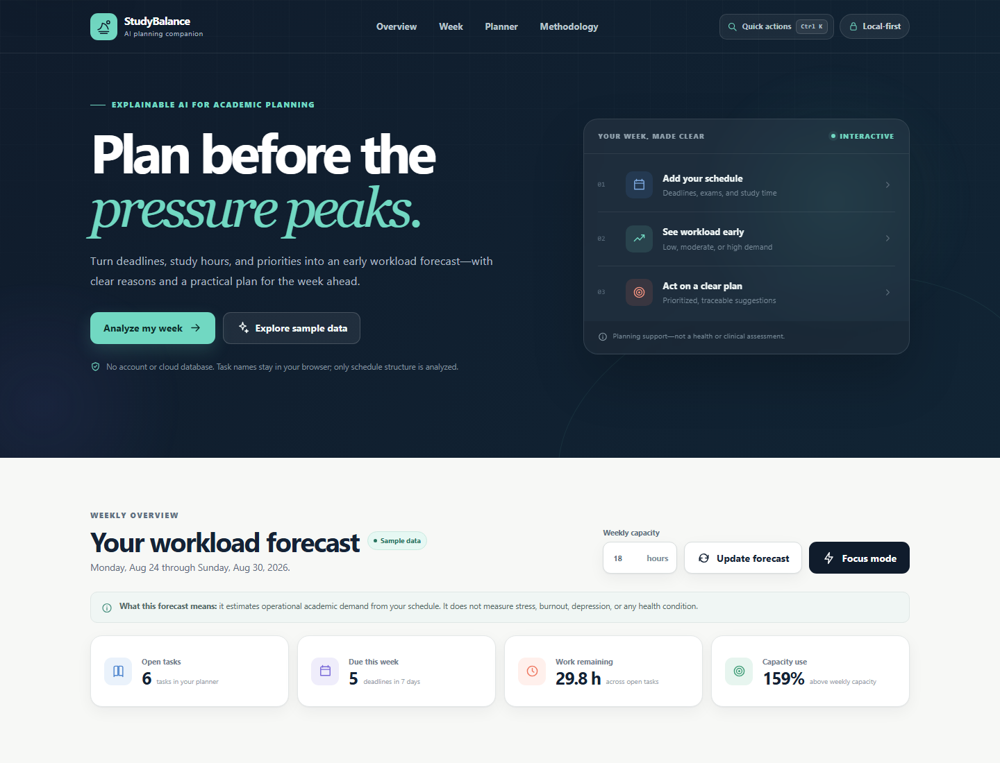
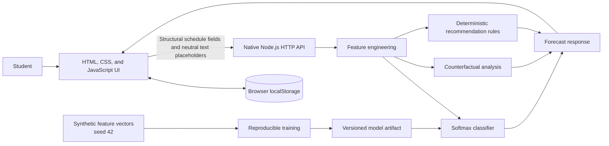

# StudyBalance AI

> An explainable academic workload forecast that helps students plan a more sustainable week.




**StudyBalance AI** is a local-first educational prototype that turns an academic task plan into a weekly workload forecast, understandable explanations, and practical planning suggestions. It combines a browser-based task planner, a multinomial logistic regression model, counterfactual explanations, deterministic recommendations, and a what-if simulator.

> [!IMPORTANT]
> StudyBalance AI does **not** diagnose stress, burnout, depression, or any other health condition. The `low`, `moderate`, and `high` labels describe patterns in the academic schedule provided to the application. They are not clinical assessments and must not replace qualified human support.

## Why this project exists

Deadlines, exams, estimated study hours, and unfinished work can cluster into difficult weeks. A useful planning tool should do more than display a warning: it should show which schedule properties influenced the estimate and offer changes the student can inspect before acting.

StudyBalance AI explores that idea through three principles:

- **Predict early:** summarize the next seven days as a workload level with model probabilities.
- **Explain plainly:** show observable schedule factors and counterfactual changes, without clinical language.
- **Support action:** produce a deterministic preventive plan while leaving every decision with the user.

## MVP features

- **Interactive task planner:** create, update, complete, search, sort, filter, and remove academic tasks; inline progress changes save immediately and refresh the forecast. The planner also supports contextual empty-state recovery, clearer reset actions for search and filters, and keyboard shortcuts such as `/` for quick search and `Esc` to reset search state.
- **Seven-day explorer:** select a day to inspect the tasks contributing modeled effort, or drag a flexible task onto a day to reschedule its deadline with a one-level undo.
- **Weekly forecast:** estimate `low`, `moderate`, or `high` overload from the next seven days.
- **Explanations:** identify influential schedule factors and show how controlled changes affect the model output.
- **Preventive action plan:** suggest prioritization, task splitting, and workload redistribution through explicit rules.
- **Scenario Lab:** preview temporary capacity and flexible-deadline changes against the baseline, then explicitly apply or reset them.
- **Focus mode:** derive a bounded local next-step sequence, move a selected task to the front, and run an optional 15-, 25-, or 45-minute timer without saving or scoring the session.
- **Fast navigation:** use a command palette, keyboard shortcuts, planner search, and a mobile action dock; nonessential motion follows the browser's reduced-motion preference.
- **Local-first privacy:** persist the planner and its search, sort, and filter preferences in browser `localStorage`; the bundled client replaces task and course names with neutral placeholders before API calls.
- **Reproducible model:** train a softmax classifier on deterministic synthetic feature vectors generated with seed `42`.
- **Small attack surface:** use Node.js 22+, JavaScript ESM, native HTTP modules, and zero runtime dependencies.

## Quick start

### Requirement

- [Node.js](https://nodejs.org/) 22 or newer.

No runtime packages need to be installed. From the repository root, start the application:

```bash
npm start
```

Open `http://localhost:3000` in a browser. Stop the server with `Ctrl+C`.

The server honors the `HOST` and `PORT` environment variables. Its default bind address is `0.0.0.0`, which may make it reachable from other devices allowed by your firewall. For a strictly loopback-only session, set `HOST` to `127.0.0.1` before starting it.

Run the automated test suite:

```bash
npm test
```

Run the complete local verification command when preparing a contribution:

```bash
npm run check
```

An optional container workflow is also available:

```bash
docker compose up --build
```

The Compose service publishes `${PORT:-3000}` on the host and is intended for demonstration, not production deployment.

## Use it in five steps

1. Add academic tasks, then search, sort, filter, or update progress directly in the planner. Empty-state actions make it easier to recover from a search or filter dead end, and the planner surfaces clearer options such as clearing search, showing open tasks, or adding another task.
2. Select a day in the seven-day explorer to inspect its modeled effort. Drag a flexible task onto a day only when changing its recorded deadline is appropriate.
3. Review the forecast, probabilities, listed factors, and preventive action plan. No single factor represents a health state.
4. Use Scenario Lab to preview capacity or flexible-deadline changes. Its deltas are `simulated - baseline`; nothing is saved until you select **Apply this scenario**.
5. Open Focus mode for a bounded local sequence and optional timer, or use the command palette and mobile dock to move quickly between views.

The browser is the source of truth for the planner. Clearing site data, using private browsing, or changing browser profiles or devices can make locally stored tasks unavailable.

Task and course names stay in the browser when the bundled web interface requests a forecast or simulation. It sends neutral placeholders together with structural fields such as dates, hours, progress, priority, and flexibility. Direct API clients construct their own request bodies and are responsible for deciding what text they send.

## How the forecast works

The pipeline is intentionally small and auditable:

1. A deterministic generator creates synthetic academic workload feature vectors with seed `42`.
2. The training script standardizes those vectors and fits a multinomial logistic regression model.
3. At runtime, a separate production extractor maps the entered seven-day schedule into the artifact's feature schema, and softmax inference estimates `low`, `moderate`, and `high` probabilities.
4. The highest probability becomes the displayed workload estimate, with its uncertainty visible.
5. Controlled feature changes produce counterfactual explanations about model behavior.
6. A separate deterministic rule engine creates planning suggestions.

User-entered tasks are **never added automatically to the training set**. Reproducibility applies to the synthetic pipeline, not to external validity. See the [Model Card](MODEL_CARD.md), [Data Card](DATA_CARD.md), and [methodology](docs/METHODOLOGY.md) for details.

## Architecture



The server uses native Node.js modules to serve static assets and expose the analysis API. The MVP has no server-side persistence and calls no third-party service. Read [Architecture](docs/ARCHITECTURE.md) for component boundaries, data flow, and trust assumptions.

### Project layout

```text
public/                         Browser interface and local planner
src/server.js                   Native HTTP server and API routes
src/domain/                     Validation, features, inference, explanations, and rules
scripts/synthetic-data.js       Seeded synthetic feature generator
scripts/train-model.js          Reproducible softmax training pipeline
models/study-balance-model.js   Versioned model artifact
tests/                          Domain and HTTP integration tests
docs/                           Technical and responsible-use documentation
```

## Design principles

- **Planning support, not diagnosis:** outputs remain limited to observable academic workload.
- **Proportional explainability:** every estimate is paired with factors and inspectable alternatives.
- **Data minimization:** no account, silent collection, advertising identifier, or telemetry.
- **Scientific honesty:** synthetic data demonstrate a technical workflow, not effectiveness with real students.
- **User control:** recommendations are optional, and scenario previews do not alter the saved plan unless the user explicitly applies them.
- **Inclusive interaction goals:** standards-based controls, keyboard paths, visible focus, responsive navigation, and reduced-motion support without claiming formal accessibility certification.

## Documentation

| Document                                         | Purpose                                                                     |
| ------------------------------------------------ | --------------------------------------------------------------------------- |
| [User Guide](docs/USER_GUIDE.md)                 | Operate the MVP and interpret results safely                                |
| [Architecture](docs/ARCHITECTURE.md)             | Understand components, data flows, and trust boundaries                     |
| [Methodology](docs/METHODOLOGY.md)               | Review the problem framing, model, counterfactuals, and evaluation approach |
| [API Reference](docs/API.md)                     | Integrate with the native HTTP analysis endpoints                           |
| [Privacy and Ethics](docs/PRIVACY_AND_ETHICS.md) | Review data handling, risks, safeguards, and prohibited uses                |
| [Model Card](MODEL_CARD.md)                      | Inspect model capabilities, intended uses, and limitations                  |
| [Data Card](DATA_CARD.md)                        | Inspect synthetic data provenance, composition, and limitations             |
| [Research References](docs/REFERENCES.md)        | Find the research used to contextualize the project                         |

## Known limitations

- The model learns from **synthetic** scenarios and has not been validated with a real university population.
- Synthetic labels encode project assumptions; they are not clinical truth or evidence of effectiveness.
- A softmax regression model is linear in feature space and may miss complex interactions.
- Forecast quality depends on the completeness and accuracy of the tasks entered by the user.
- Model probabilities must not be read as probabilities of burnout, stress, illness, or academic failure.
- Counterfactuals show how this model responds to a controlled input change; they do not establish causality.
- Recommendations are general planning rules and may not account for personal, pedagogical, accessibility, or institutional constraints.
- `localStorage` is not an encrypted vault. A person with access to the same browser profile may be able to inspect its contents.
- The MVP provides no account, cross-device sync, collaboration, automatic backup, or academic system integration.

These limitations rule out institutional decision-making, health screening, surveillance, disciplinary evaluation, student ranking, or any adverse action based on the output.

## Quality and reproducibility

`npm test` exercises the project's automated checks, including core model and API invariants. Seed `42` makes synthetic generation and training reproducible for the same code version and JavaScript runtime. Technical determinism does **not** imply external validity, fairness, or calibration for real students.

Any change to the generator, feature schema, synthetic labels, or model artifact should update the corresponding tests, [Model Card](MODEL_CARD.md), and [Data Card](DATA_CARD.md).

## Privacy, ethics, and well-being

StudyBalance AI is designed around data minimization and student control. Research with participants or institutional deployment would still require appropriate ethics review, informed consent, security testing, bias analysis, accessibility review, and a documented data governance and deletion process.

If academic demands are affecting your health or safety, seek appropriate human support, such as a trusted person, a student support service, or a qualified professional. StudyBalance AI is not an emergency service.

The project is related to **United Nations Sustainable Development Goal 3, Good Health and Well-Being**, and **Goal 4, Quality Education**. This relationship expresses the project's motivation; it is not a claim that this MVP measures or achieves either goal.

## Research context

The project is motivated by research on factors associated with student stress, prediction from academic stressors, and adaptive support. These publications provide context only; they do **not** validate this repository's synthetic data, model, explanations, or recommendations.

- De Filippis and Foysal (2024), DOI [`10.1007/s44163-024-00169-6`](https://doi.org/10.1007/s44163-024-00169-6).
- Bastos et al. (2025), DOI [`10.1016/j.bbr.2024.115328`](https://doi.org/10.1016/j.bbr.2024.115328).
- Kannan, Deepa, and Devi (2025), DOI [`10.1007/s10791-025-09867-w`](https://doi.org/10.1007/s10791-025-09867-w).

## Contributing, citation, and license

Contributions are welcome, especially in accessibility, testing, explainability, and responsible evaluation. Read [CONTRIBUTING.md](CONTRIBUTING.md) before opening a change.

Use [CITATION.cff](CITATION.cff) to cite the software. The code and documentation are available under the [MIT License](LICENSE).
