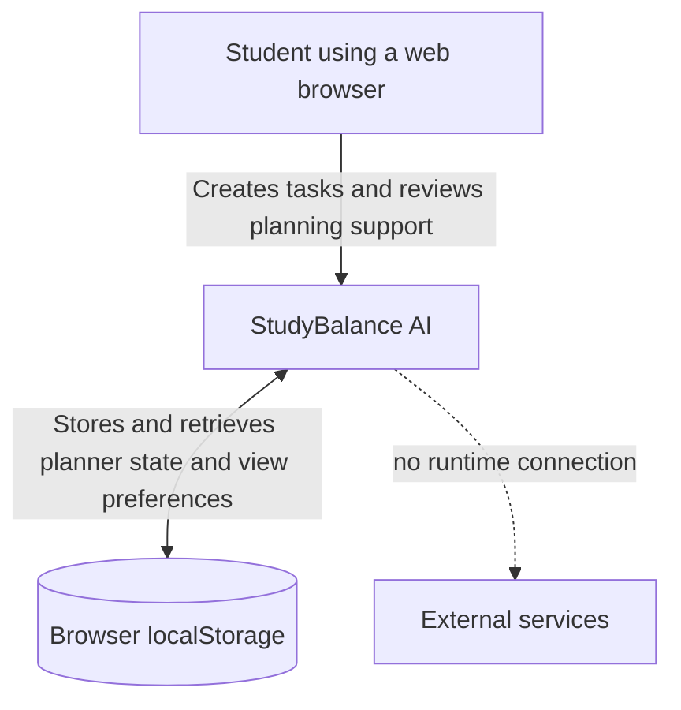
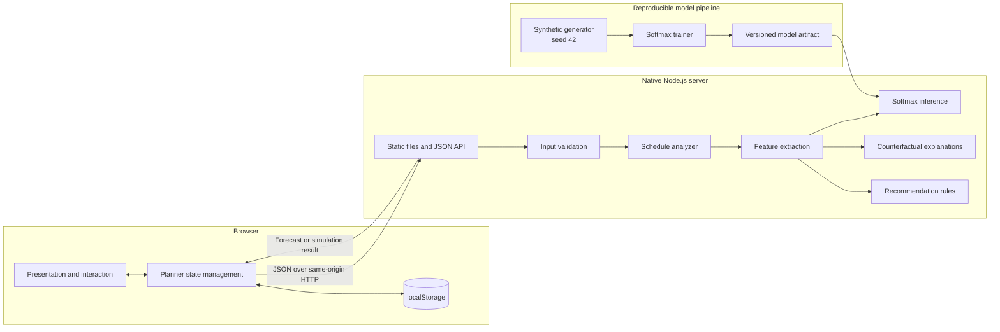
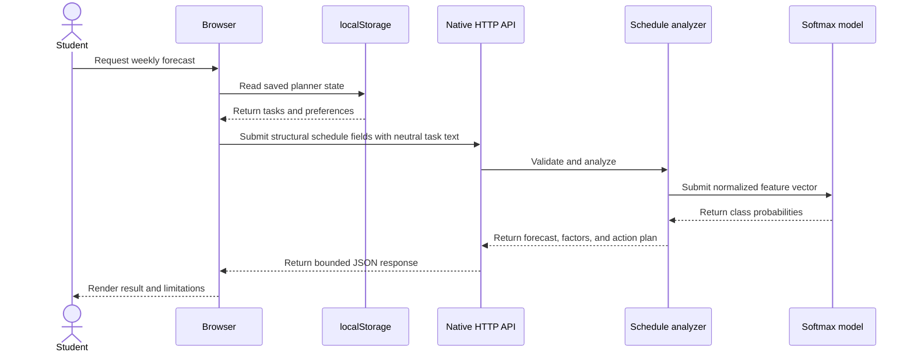

# Architecture

## 1. Scope

StudyBalance AI is a single-process web application for local academic planning. A native Node.js HTTP server delivers a standards-based frontend and exposes analysis endpoints. The browser owns task and view-preference persistence; the server performs validation, feature extraction, model inference, counterfactual analysis, and deterministic recommendation generation. Before the bundled web client calls an endpoint, it replaces task and course names with neutral placeholders and sends the structural schedule fields needed for analysis.

The architecture optimizes for auditability, reproducibility, and a small operational footprint. It does not attempt to provide accounts, multi-user collaboration, institutional integration, or clinical assessment.

## 2. System context



There is no required cloud service or external model API. All information needed for a forecast comes from the schedule submitted by the browser and the versioned local model artifact.

## 3. Component view



### 3.1 Frontend

The frontend uses HTML, CSS, and browser JavaScript without a framework. It is responsible for:

- collecting and presenting academic task information;
- persisting tasks, weekly capacity, and planner search, sort, and filter preferences in `localStorage`;
- retaining task and course names in the browser while sending neutral placeholders and structural schedule fields for analysis or simulation;
- rendering a selectable seven-day modeled workload view and its contributing-task drilldown;
- saving inline progress immediately, refreshing the forecast, and supporting a one-level undo after a flexible task is dragged to a new deadline;
- rendering probabilities, factors, recommendations, and comparison results;
- keeping Scenario Lab changes separate from saved tasks unless the user explicitly applies a change;
- deriving the Focus mode sequence, moving the selected task to its front, and running the timer as ephemeral browser state;
- providing a command palette, scoped keyboard shortcuts, a mobile action dock, and reduced-motion behavior.

### 3.2 HTTP boundary

The HTTP layer uses native Node.js modules. It is responsible for:

- serving static frontend assets;
- accepting JSON requests for analysis and simulation;
- enforcing method, path, JSON media type, body-size, and schema constraints;
- mapping domain errors to bounded, non-sensitive JSON responses;
- preventing request data from becoming server-side application state.

The endpoint contracts are documented in [API.md](API.md). Every request must be treated as untrusted, even when the server is used only on a local machine.

Neutralizing private display text is a behavior of the bundled web client, not an HTTP-boundary guarantee. Direct API clients construct their own JSON request bodies and decide what content to submit.

### 3.3 Domain analysis

The domain is organized as small ESM modules under `src/domain`:

| Module               | Responsibility                                       |
| -------------------- | ---------------------------------------------------- |
| `date.js`            | Date normalization and seven-day window calculations |
| `validation.js`      | Domain-level input validation and normalization      |
| `model-schema.js`    | Feature and model artifact compatibility checks      |
| `features.js`        | Deterministic schedule-to-feature transformation     |
| `model.js`           | Softmax inference and probability handling           |
| `explanations.js`    | Observable factors and counterfactual comparisons    |
| `recommendations.js` | Deterministic preventive planning rules              |
| `analyzer.js`        | Analysis and simulation orchestration                |

The public domain operations are conceptually:

```js
analyzeSchedule({ tasks, weeklyAvailableHours, referenceDate });
simulateRebalance({
  tasks,
  weeklyAvailableHours,
  referenceDate,
  adjustments,
});
```

The analyzer returns data rather than causing persistence or network side effects. This makes the central behavior testable independently of HTTP and the browser.

### 3.4 Model pipeline

The reproducible pipeline is separate from request handling:

- `scripts/synthetic-data.js` generates artificial workload feature vectors directly with seed `42`.
- `scripts/train-model.js` trains and evaluates the multinomial logistic regression.
- `models/study-balance-model.js` is the versioned artifact consumed by inference.

Runtime analysis must never retrain the model with user tasks. A new artifact is an explicit source-controlled change that requires updated tests, [MODEL_CARD.md](../MODEL_CARD.md), and [DATA_CARD.md](../DATA_CARD.md).

## 4. Analysis flow



The application does not intentionally persist the request body on the server. In the bundled web flow, task titles and course names remain in the browser; identifiers, dates, types, hours, progress, priorities, flexibility, reference date, and weekly capacity are sent transiently with neutral text placeholders. Operators who place the server behind a proxy must independently ensure that proxy and access logs do not capture request payloads.

## 5. What-if flow

A Scenario Lab simulation contains a baseline schedule and explicit temporary adjustments to weekly capacity or an unfinished flexible task's deadline. The user can request **Preview scenario**, while relevant range changes also preview automatically when committed. The domain applies the changes to a copy, analyzes both versions with the same model, and returns:

- the baseline result;
- the simulated result;
- a bounded comparison of the two forecasts;
- the adjustments that were accepted by validation.

Comparison deltas are calculated as `simulated - baseline`; a lower simulated score is not a claim that a plan is healthier or preferable. The simulation endpoint does not modify `localStorage`. **Apply this scenario** is the explicit frontend action that persists supported changes, while **Reset** discards the temporary controls and result.

## 6. Data lifecycle

| Stage                          | Location                        | Persistence                               | Notes                                                                                   |
| ------------------------------ | ------------------------------- | ----------------------------------------- | --------------------------------------------------------------------------------------- |
| Task entry                     | Browser memory                  | Temporary                                 | Controlled by the user                                                                  |
| Planner state                  | Browser `localStorage`          | Until cleared                             | No automatic backup or encryption                                                       |
| Planner view preferences       | Browser `localStorage`          | Until cleared                             | Search text, sort order, and filter selection remain local                              |
| Selected day and undo snapshot | Browser memory                  | UI lifetime or next applicable change     | Selected-day detail is ephemeral; undo holds one planner snapshot                       |
| Scenario Lab draft             | Browser memory                  | Until reset, apply, or page lifetime ends | Does not modify the planner before explicit apply                                       |
| Focus sequence and timer       | Browser memory                  | Page lifetime                             | Bounded local aid; not saved or scored                                                  |
| Analysis request               | Browser and HTTP process memory | Request lifetime                          | Bundled client neutralizes task and course names; direct clients control their payloads |
| Analysis result                | Browser memory                  | UI lifetime                               | Contains model-derived output                                                           |
| Synthetic training data        | Training process                | Reproducibly generated                    | Represents no real person                                                               |
| Model artifact                 | Repository and server memory    | Versioned                                 | Contains coefficients and metadata, not student records                                 |

## 7. Trust boundaries and threats

### Browser storage

`localStorage` is same-origin storage, not a secure database. Anyone who can use the same unlocked browser profile, any script executing in the origin, or a compromised browser extension may be able to read planner data and persisted planner-view preferences, including search text.

### HTTP input

The server must reject malformed JSON, oversized bodies, invalid dates, unsupported task types, non-finite numbers, duplicate identifiers, and values outside documented ranges. Client-side validation improves usability but is never a security boundary.

### Network exposure

The development server is intended for local use, but its default `HOST` value is `0.0.0.0`, which listens on every available interface. A strictly local session should set `HOST=127.0.0.1`. Any deployment beyond a trusted local environment requires HTTPS, deliberate binding and firewall rules, hardened security headers, rate limiting, access controls where needed, safe operational logging, and an explicit retention policy.

### Model output

Model probabilities and explanations can look authoritative. The interface and API therefore preserve a non-diagnostic disclaimer, avoid health labels, and expose uncertainty rather than presenting a categorical result as fact.

## 8. Architectural decisions

### Native platform modules

Zero runtime dependencies reduce installation friction, supply-chain exposure, and hidden behavior. The tradeoff is that routing, validation, security controls, and accessibility receive no framework defaults and must be implemented and tested directly.

### Local-first persistence

Browser storage supports privacy by minimization and makes the MVP easy to run. The tradeoff is no built-in backup, encryption, device sync, collaborative use, or centralized account recovery.

### Separate prediction and recommendation

The classifier estimates a workload class. A separate rule engine creates planning suggestions. This boundary prevents a probabilistic model from silently deciding what a student should do and makes each recommendation auditable.

### Local interaction state

The selectable week, day drilldown, one-level undo, command palette, mobile dock, Scenario Lab controls, and Focus timer are browser interaction mechanisms rather than new model inputs. Global single-key shortcuts are suppressed while focus is in an editable field. Nonessential reveal motion is disabled when `prefers-reduced-motion: reduce` is active. These implementation choices support multiple ways to operate the interface but do not constitute accessibility certification.

### Versioned model artifact

Training is an explicit development operation, while inference is deterministic at runtime. Artifact metadata must identify its feature schema and training configuration so incompatible code fails clearly.

## 9. Deployment boundary

The MVP is suitable for local demonstration and software experimentation. It is not an institution-ready service. Production or research deployment requires, at minimum:

- an approved data governance and deletion process;
- ethics review and informed consent when human research is involved;
- threat modeling, security testing, and privacy review;
- accessibility testing with representative users;
- external model validation, calibration, and subgroup analysis;
- monitoring designed not to become student surveillance;
- a clear owner for incidents, updates, and user support.
